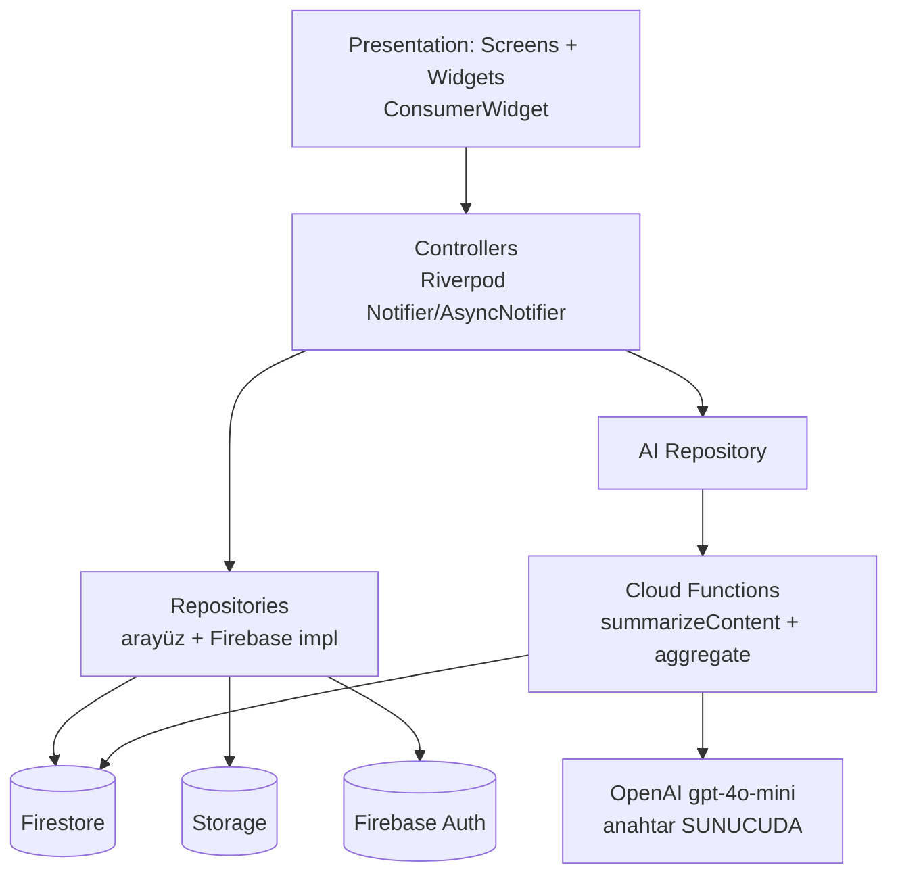
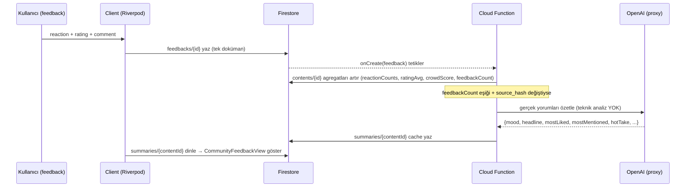

# feat: FeedbackToMe 2.0 — Sosyal Geri Bildirim Platformu (Senaryo B)

## Summary

FeedbackToMe, tek-link anonim geri bildirim toplayıcıdan (Senaryo A), verilen 24-ekran tasarımına göre **tam sosyal geri bildirim platformuna (Senaryo B)** yeniden inşa edilir: kullanıcılar içerik paylaşır (görsel/link/metin, sonra video), diğer **gerçek** kullanıcılar reaction + puan + kısa yorum bırakır, AI **yalnızca gerçek yorumları** gruplayıp basit/eğlenceli özet üretir. Yeni **feature-based + Riverpod** mimari; Firebase (Auth/Firestore/Storage/Functions) + OpenAI. Eski link/24saat/IAP modeli kaldırılır. Teslim **fazlı MVP**: önce uçtan-uca çekirdek döngü, sonra keşif/takip/bildirim, sonra versiyon/video/cila.

---

## Problem Frame

**Neden bu değişiklik?** Mevcut ürün (Senaryo A) tek kişilik bir link paylaşıp o linke gelen anonim yorumları özetliyor; sosyal keşif, içerik yükleme, takip ve topluluk yok. Kullanıcının yeni vizyonu (24-ekran tasarım + TAM UYGULAMA PROMPTU) bambaşka bir ürün: **sosyal medya tarzı bir geri bildirim topluluğu** — "Post it. See what people really think." İnsanlar içeriklerini paylaşır, topluluk feedback verir, AI bu gerçek feedback'i sıcak bir özete çevirir.

**Mevcut durumla ilişki.** İlk denetimde (`AUDIT_FEEDBACKTOME_2.0.md`) bu, "Senaryo B" olarak işaretlenmiş ve MVP-rewrite ölçeğinde olduğu belirtilmişti. Bu oturumda kurulan **feedback motoru** (reaction seti, tek Crowd Score, `CommunityFeedbackSummary` + `summarizeCommunity` AI özeti, `CommunityFeedbackView`, sunucu-tarafı AI proxy — P0.1) yeni tasarımın **13–17. ekranlarına** (Reaction, Rating, Short Comment, Feedback Results, AI Summary) neredeyse birebir karşılık gelir ve doğrudan yeniden kullanılır. Yani rebuild "sıfırdan" değildir: sosyal katman yeni, feedback çekirdeği hazır.

**AI felsefesi korunur.** Tasarım ve prompt açıkça "Teknik analiz yapma, insan diliyle içgörü üret" diyor — bu, Senaryo A'da uyguladığımız ilkenin (AI kendi teknik/tasarım görüşünü üretmez, yalnızca gerçek yorumları özetler) aynısı. Örnek başlıklar: "İnsanlar neyi sevdi ❤️", "İnsanlar neyi merak etti 👀", "Genel izlenim".

---

## Requirements

Tasarım ekranları (E1–E24) ve TAM UYGULAMA PROMPTU'ndan izlenebilir.

- **R1 — Auth (E2/E3/E4):** Email/şifre + Google + Apple ile kayıt/giriş; oturum kalıcılığı; çıkış.
- **R2 — Profil (E5/E21/E22/E23):** Profil kurulum (ad, kullanıcı adı/handle, bio, foto), görüntüleme, düzenleme; public profile; gönderi/takipçi/takip sayaçları.
- **R3 — İçerik paylaşma (E8/E9/E10/E11):** Tip seç (görsel/video/link/fikir/metin) → başlık+açıklama+kategori → geri bildirim sorusu → önizle & yayınla. Storage'a medya yükleme.
- **R4 — Feed (E6):** "Senin için" + "Takip Edilenler" akışı; trend/yeni içerikler; içerik kartları.
- **R5 — Discover (E7):** Arama + kategori filtreleri (Tümü/Web/Mobil/Tasarım/Video) + trend içerikler.
- **R6 — Feedback verme (E12/E13/E14/E15):** İçerik detay → Reaction seç → Puan ver → Kısa yorum yaz → gönder.
- **R7 — Feedback sonuçları (E16):** Toplam puan, reaction dağılımı (%), yorum sayısı, istatistik.
- **R8 — AI özet (E17):** Gerçek yorumları grupla; "İnsanlar neyi sevdi/merak etti", "Genel izlenim"; teknik jargon yok; kısa+samimi; az veride kesin yargı yok.
- **R9 — Tüm feedback (E18):** İçerik için tüm gerçek yorumların listesi + filtre.
- **R10 — Yeni versiyon (E19):** İçeriğin yeni versiyonunu oluşturup tekrar paylaşma; versiyon geçmişi.
- **R11 — Bildirimler/aktivite (E20):** Feedback/takip/etkileşim bildirimleri akışı.
- **R12 — Ayarlar (E24):** Hesap, bildirim, gizlilik, destek, dil, tema.
- **R13 — Localization:** TR/EN; tüm metinler l10n'da; her ekranda dil değiştirme.
- **R14 — Tema:** Açık/koyu mod desteği.
- **R15 — Mimari:** Feature-based, Riverpod, modüler/okunabilir/ölçeklenebilir.
- **R16 — Güvenlik:** AI anahtarı istemcide yok (proxy/Function); kullanıcı başkasının içeriğini/feedback'ini değiştiremez; aynı içeriğe tek feedback; agregatlar yalnızca sunucudan yazılır.
- **R17 — Store-ready:** Başarılı/hatalı/boş durum UI'ları + animasyonlar; mağaza yayınına hazır seviye.

---

## Key Technical Decisions

- **KTD1 — Yeni proje iskeleti, mevcut repo içinde `app_v2/` (veya yeni dizin ağacı) olarak.** Sıfırdan feature-based; eski `lib/` (Senaryo A) referans/geçici olarak durur, yeni yapı ayrı build hedefi olur, doğrulanınca eski `lib/` kaldırılır. **Gerekçe:** ~5000 satırlık `main.dart`'a graft riskli; temiz mimari 24 ekran için şart. **Yeniden kullanım fiziksel kopya + uyarlama ile** yapılır (aşağıdaki Reuse Haritası).
- **KTD2 — State management: Riverpod** (v2, `Notifier`/`AsyncNotifier`). Feature başına controller + repository. Firebase erişimi repository arkasında; UI provider'ları izler. **Gerekçe:** prompt zorunlu kılıyor; test edilebilir, ölçeklenir.
- **KTD3 — Routing: `go_router`** (deklaratif, deep-link/auth-redirect dostu). **Gerekçe:** mevcut Navigator 1.0 (isimsiz push) 24 ekran + shell (bottom nav) için yetersiz.
- **KTD4 — Tema: açık+koyu, `ThemeMode` + Riverpod ile kalıcı.** Mevcut koyu tema (`buildFeedbackTheme`) taban; açık varyant eklenir; renk token'ları `AppTheme`'den. **Gerekçe:** tasarım her ekranda açık/koyu gösteriyor; mevcut tema koyu-only.
- **KTD5 — Localization: Flutter `gen-l10n` (ARB dosyaları).** Mevcut elle-map `app_localizations.dart` yerine ARB (`app_tr.arb`/`app_en.arb`). **Gerekçe:** 24 ekran/yüzlerce metin için ölçeklenir; mevcut string'ler taşınır.
- **KTD6 — Veri modeli: `contents` merkezli; feedback tek dokümanda reaction+rating+comment birleşik.** Prompt: "reactions (veya feedback içinde), ratings (veya feedback içinde)". Kullanıcı-içerik başına **tek** feedback dokümanı = {reaction, rating, comment}. Agregatlar (`reactionCounts`, `ratingAvg`, `ratingCount`, `feedbackCount`, `crowdScore`) `contents` dokümanında denormalize; **Cloud Function ile fan-in** güncellenir.
- **KTD7 — AI özet: Cloud Function `summarizeContent` (Admin) + mevcut `summarizeCommunity` mantığı.** Özet `contents/{id}` altında `source_hash` ile cache'lenir (P0.2 `processedPurchases` desenine benzer); feedback değişmedikçe yeniden üretilmez; eşik-tabanlı tetikleyici. Anahtar sunucuda (R16). **Gerekçe:** maliyet + güvenlik; mevcut proxy/Functions altyapısı hazır.
- **KTD8 — Takip grafiği: `follows` + denormalize sayaçlar.** `follows/{followerId}_{followedId}` dokümanı; `users` üzerinde `followersCount`/`followingCount`/`postsCount` Function ile artırılır. **Gerekçe:** okuma-ucuz feed/profil; Firestore fan-out MVP için basit tutulur (karmaşık feed fan-out'u ertelenir).
- **KTD9 — Feed MVP: sorgu-tabanlı, fan-out yok.** "Senin için" = son içerikler (kategoriye göre); "Takip Edilenler" = takip edilen kullanıcıların içerikleri (`whereIn` + sayfalama). Gerçek fan-out/timeline **ertelenir** (Faz 3+/gelecek). **Gerekçe:** MVP hızı; ölçek gelince optimize edilir.
- **KTD10 — Medya: Faz 1'de görsel+link+metin (Storage image upload), video Faz 3.** **Gerekçe:** video maliyeti/karmaşıklığı (thumbnail, transcode, oynatma) MVP'yi geciktirir.

---

## High-Level Technical Design

### Katman mimarisi



### Veri modeli (Firestore)

```mermaid
erDiagram
  USERS ||--o{ CONTENTS : "owns"
  USERS ||--o{ FEEDBACKS : "gives"
  CONTENTS ||--o{ FEEDBACKS : "receives"
  CONTENTS ||--o{ VERSIONS : "has"
  CONTENTS ||--|| SUMMARY : "cached AI"
  USERS ||--o{ FOLLOWS : "follower"
  USERS ||--o{ NOTIFICATIONS : "receives"

  USERS { string uid PK; string handle UK; string displayName; string photoUrl; string bio; int postsCount; int followersCount; int followingCount }
  CONTENTS { string id PK; string ownerId FK; string type; string title; string description; string category; string mediaUrl; string feedbackQuestion; int currentVersion; map reactionCounts; num ratingAvg; int ratingCount; int feedbackCount; num crowdScore; ts createdAt }
  FEEDBACKS { string id PK; string contentId FK; string responderId FK; string reaction; int rating; string comment; ts createdAt }
  VERSIONS { string id PK; string contentId FK; int version; string mediaUrl; ts createdAt }
  SUMMARY { string contentId PK; json summaryJson; string sourceHash; int feedbackCount; ts generatedAt }
  FOLLOWS { string id PK; string followerId FK; string followedId FK; ts createdAt }
  NOTIFICATIONS { string id PK; string userId FK; string type; string actorId; string contentId; bool read; ts createdAt }
```

### Feedback → agregat → AI özet akışı



---

## Output Structure

Yeni feature-based ağaç (KTD1). Kesin yollar uygulama sırasında rafine edilebilir.

```
lib/
  main.dart                     # ProviderScope + FeedbackToMeApp
  app.dart                      # MaterialApp.router + tema + l10n
  core/
    router/app_router.dart      # go_router + auth redirect + shell (bottom nav)
    theme/                      # app_theme.dart (light+dark tokens), theme_mode_provider.dart
    l10n/                       # app_tr.arb, app_en.arb (gen-l10n)
    firebase/firebase_options.dart   # mevcut dosyadan taşınır
    services/                   # storage_service.dart, ai_client.dart (proxy)
    widgets/                    # ortak: buttons, empty_state, error_state, loading, avatar
  features/
    auth/          data/ (auth_repository) domain/ presentation/ (login, register, welcome) providers/
    onboarding/    presentation/ (splash, profile_setup)
    profile/       data/ domain/ presentation/ (my_profile, public_profile, edit_profile) providers/
    upload/        presentation/ (create_type, content_info, ask_feedback, preview_publish) providers/
    feed/          data/ presentation/ (feed) providers/
    discover/      data/ presentation/ (discover) providers/
    content/       data/ (content_repository) domain/ (content model) presentation/ (content_detail, all_feedback) providers/
    feedback/      data/ (feedback_repository) domain/ (feedback, community_summary) presentation/ (reaction, rating, comment, results = CommunityFeedbackView) providers/
    notifications/ data/ presentation/ providers/
    settings/      presentation/ providers/
functions/                      # mevcut; summarizeContent + aggregate function eklenir
firestore.rules                 # yeni koleksiyonlar için sertleştirilir
```

---

## Reuse Haritası (mevcut Senaryo A kodundan taşınacaklar)

| Mevcut (`lib/…`) | Yeni yapıda | Uyarlama |
|---|---|---|
| `firebase_options.dart` | `core/firebase/` | Aynen (aynı Firebase projesi) |
| `theme/feedback_material_theme.dart` + `app_theme.dart` | `core/theme/` | Açık tema varyantı ekle (KTD4) |
| `l10n/app_localizations.dart` | `core/l10n/*.arb` | ARB'ye taşı (KTD5) |
| `config/feedback_reactions.dart` | `features/feedback/domain/` | Aynen (reaction seti) |
| `services/rating_service.dart` (Crowd Score) | `features/feedback/domain/` | Aynen |
| `models/community_feedback_summary.dart` | `features/feedback/domain/` | "link" → "content" bağlamına genişlet |
| `services/openai_audience_client.dart` `summarizeCommunity` (P0.1 proxy) | Cloud Function `summarizeContent` | Sunucuya taşı (KTD7); prompt kuralları korunur |
| `widgets/community_feedback_view.dart` | `features/feedback/presentation/` | E16/E17 tasarımına uyarla (koyu-zemin fix dahil) |
| `functions/` (Cloud Functions altyapısı) | `functions/` | `summarizeContent` + `aggregate` function ekle |
| `models/user_profile.dart` | `features/profile/domain/` | Sosyal alanlarla genişlet (handle, bio, sayaçlar) |

**Kaldırılacak (yeni üründe yok):** tek-link modeli (`feedback_link`), 24 saat/demo/premium mantığı, IAP (`iap_service`, `premium_screen`, `iap_products`, P0.2 `iapVerify`), creator survey, kapsamlı danışman raporu (`creator_intelligence_*`). Bunlar eski `lib/` kaldırılınca gider.

---

## Implementation Units

U-ID'ler kalıcıdır. Fazlara gruplanmıştır; faz içi sıra bağımlılık-düzenlidir.

### Faz 0 — İskelet & Altyapı

### U1. Yeni feature-based proje iskeleti (Riverpod + go_router + tema + l10n)
- **Goal:** Boş ama çalışan uygulama kabuğu: `ProviderScope`, `MaterialApp.router`, go_router (splash→auth-gate→shell/bottom-nav placeholder), açık/koyu tema + ThemeMode, gen-l10n TR/EN, Firebase init.
- **Requirements:** R13, R14, R15.
- **Dependencies:** —
- **Files:** `lib/main.dart`, `lib/app.dart`, `lib/core/router/app_router.dart`, `lib/core/theme/app_theme.dart`, `lib/core/theme/theme_mode_provider.dart`, `lib/core/l10n/app_tr.arb`, `lib/core/l10n/app_en.arb`, `l10n.yaml`, `pubspec.yaml` (flutter_riverpod, go_router, gen-l10n), test: `test/core/router_test.dart`.
- **Approach:** Splash (E1) → auth durumu provider'ı → giriş yoksa Welcome, varsa shell (bottom nav: Feed/Discover/Create/Notifications/Profile — E6 alt bar). Tema token'ları mevcut `AppTheme`'den; açık varyant paralel token seti.
- **Patterns to follow:** Mevcut `buildFeedbackTheme` renk/token yaklaşımı; mevcut l10n string içerikleri (ARB'ye taşınır).
- **Test scenarios:** Uygulama açılır ve splash→(oturumsuz)Welcome yönlenir; ThemeMode değişimi açık/koyu uygular; dil TR↔EN değişince örnek metin değişir.
- **Verification:** `flutter analyze` temiz; app boş kabukla açılır; bottom-nav sekmeleri gezinir (placeholder ekranlar).

### U2. Ortak veri katmanı: repository soyutlamaları + modeller + Storage servisi
- **Goal:** Firestore/Storage erişimini repository arkasına al; çekirdek modeller (User, Content, Feedback, CommunityFeedbackSummary) + Storage upload iskeleti.
- **Requirements:** R15, R16.
- **Dependencies:** U1
- **Files:** `lib/features/profile/domain/user_model.dart`, `lib/features/content/domain/content_model.dart`, `lib/features/feedback/domain/feedback_model.dart`, `lib/features/feedback/domain/community_feedback_summary.dart` (taşınır), `lib/core/services/storage_service.dart`, test: `test/models/*_test.dart`.
- **Approach:** Modeller `fromMap/toMap` + immutable; reaction seti ve Crowd Score mevcut dosyalardan taşınır. Storage servisi: görsel yükleme + indirme URL (video ertelenir).
- **Patterns to follow:** Mevcut `community_feedback_summary.dart`, `feedback_reactions.dart`, `rating_service.dart`.
- **Test scenarios:** Model `toMap→fromMap` round-trip; eksik alanlar güvenli defaults; reaction→duygu türetme; Crowd Score hesabı (mevcut testlerle uyum).
- **Verification:** Modeller derlenir; birim testleri geçer.

### Faz 1 — MVP Çekirdek Dikey Dilim (uçtan-uca döngü)

### U3. Auth: email/şifre + Google + Apple + oturum yönetimi
- **Goal:** Kayıt (E4), Giriş (E3), Welcome (E2); AuthRepository + AuthController (Riverpod); go_router redirect.
- **Requirements:** R1.
- **Dependencies:** U1
- **Files:** `lib/features/auth/data/auth_repository.dart`, `lib/features/auth/providers/auth_controller.dart`, `lib/features/auth/presentation/{welcome,login,register}_screen.dart`, test: `test/features/auth/auth_controller_test.dart`.
- **Approach:** Firebase Auth: `createUserWithEmailAndPassword`, `signInWithEmailAndPassword`, Google (`signInWithPopup`/`google_sign_in`), Apple. Hata mesajları l10n. Redirect: oturumsuz→Welcome, oturumlu+profil yok→ProfileSetup, oturumlu+profil var→Feed.
- **Patterns to follow:** Mevcut `auth_service.dart` (Google/Apple mantığı) + `firebaseAuthUserMessage`.
- **Test scenarios:** Geçerli email/şifre giriş yapar; hatalı şifre → l10n hata; kayıt yeni kullanıcı oluşturur → ProfileSetup'a yönlenir; çıkış → Welcome.
- **Verification:** Üç yöntemle giriş; redirect zinciri doğru; oturum kalıcı (reload).

### U4. Profil: kurulum + görüntüleme + düzenleme (handle benzersizliği)
- **Goal:** Profile Setup (E5), My Profile (E21), Edit Profile (E23); `users` koleksiyonu; benzersiz handle.
- **Requirements:** R2.
- **Dependencies:** U3, U2
- **Files:** `lib/features/profile/data/profile_repository.dart`, `lib/features/profile/providers/profile_controller.dart`, `lib/features/onboarding/presentation/profile_setup_screen.dart`, `lib/features/profile/presentation/{my_profile,edit_profile}_screen.dart`, test: `test/features/profile/profile_controller_test.dart`.
- **Approach:** Handle benzersizliği: `handles/{handle}` rezervasyon dokümanı (transaction). Sayaçlar (posts/followers/following) başlangıç 0. My Profile: kullanıcı içerikleri grid (E21).
- **Patterns to follow:** Mevcut `user_profile.dart`.
- **Test scenarios:** Handle alınmışsa reddedilir; profil kaydı `users/{uid}` yazar; edit değişiklikleri kalıcı; boş ad reddedilir.
- **Verification:** Kurulum→profil görüntüleme→düzenleme akışı çalışır; handle çakışması engellenir.

### U5. İçerik paylaşma akışı + Storage görsel yükleme
- **Goal:** Create/Upload (E8) → Content Info (E9) → Ask for Feedback (E10) → Preview & Publish (E11). Tip: görsel/link/fikir/metin (video Faz 3).
- **Requirements:** R3, R10 (kısmi — currentVersion=1).
- **Dependencies:** U4, U2
- **Files:** `lib/features/upload/presentation/{create_type,content_info,ask_feedback,preview_publish}_screen.dart`, `lib/features/upload/providers/upload_controller.dart`, `lib/features/content/data/content_repository.dart`, test: `test/features/upload/upload_controller_test.dart`.
- **Approach:** Çok-adımlı sihirbaz (Riverpod state). Görsel → `storage_service` upload → URL. `contents/{id}` yaz: type, title, description, category, mediaUrl, feedbackQuestion, currentVersion=1, sıfır agregatlar. Yayınla → içerik detay/feed'e dön.
- **Patterns to follow:** Mevcut Storage yok — yeni; content model U2.
- **Test scenarios:** Görsel içerik yayınlanır (mediaUrl dolu); metin içerik medyasız yayınlanır; başlıksız yayın reddedilir; feedback sorusu opsiyonel kaydedilir.
- **Verification:** Dört adımlı akış içerik oluşturur; içerik feed'de/profilde görünür.

### U6. Feed: "Senin için" + "Takip Edilenler"
- **Goal:** Home/Feed (E6) — iki sekme, içerik kartları, sayfalama.
- **Requirements:** R4.
- **Dependencies:** U5
- **Files:** `lib/features/feed/data/feed_repository.dart`, `lib/features/feed/providers/feed_controller.dart`, `lib/features/feed/presentation/feed_screen.dart`, `lib/core/widgets/content_card.dart`, test: `test/features/feed/feed_controller_test.dart`.
- **Approach (KTD9):** "Senin için" = son içerikler (ters-kronolojik, sayfalı). "Takip Edilenler" = takip edilen owner'ların içerikleri (`whereIn`/çoklu sorgu; takip sistemi U11 gelene kadar boş-durum). İçerik kartı: kapak, başlık, sahip, mini istatistik, "Geri Bildirim Ver".
- **Patterns to follow:** —
- **Test scenarios:** Feed son içerikleri gösterir; sayfalama sonraki sayfayı yükler; boş feed → empty-state; içerik yoksa placeholder.
- **Verification:** Feed akar, kaydırınca sayfalar; karttan içerik detayına gidilir.

### U7. İçerik detay + feedback verme (reaction + rating + kısa yorum)
- **Goal:** Content Detail (E12) → Reaction (E13) → Rating (E14) → Short Comment (E15) → gönder. Mevcut reaction/rating motorunu yeniden kullan.
- **Requirements:** R6.
- **Dependencies:** U6, U2
- **Files:** `lib/features/content/presentation/content_detail_screen.dart`, `lib/features/feedback/presentation/{reaction,rating,comment}_step.dart`, `lib/features/feedback/data/feedback_repository.dart`, `lib/features/feedback/providers/feedback_controller.dart`, test: `test/features/feedback/feedback_controller_test.dart`.
- **Approach:** Tek `feedbacks/{id}` dokümanı = {contentId, responderId, reaction, rating, comment} (KTD6). Kullanıcı-içerik başına tek feedback (varsa güncelle). Reaction seti + puan (yıldız) mevcut bileşenlerden.
- **Patterns to follow:** `feedback_reactions.dart`, `rating_service.dart`.
- **Test scenarios:** Reaction+puan+yorum tek doküman yazar; aynı kullanıcı ikinci kez → günceller (çift değil); yorum min-uzunluk; kendi içeriğine feedback engellenir/uyarılır (karar: engelle).
- **Verification:** Üç adımlı feedback döngüsü çalışır; feedback Firestore'da tek doküman.

### U8. Feedback sonuçları + AI özet (Cloud Function `summarizeContent`)
- **Goal:** Feedback Results (E16) + AI Summary (E17): Crowd Score, reaction dağılımı, AI özet (mostLiked/mostMentioned/hotTake/genel izlenim). `CommunityFeedbackView` uyarlanır.
- **Requirements:** R7, R8, R16.
- **Dependencies:** U7, U9
- **Files:** `lib/features/feedback/presentation/feedback_results_screen.dart` (CommunityFeedbackView uyarlaması), `lib/features/feedback/data/summary_repository.dart`, `functions/src/summarizeContent.ts`, test: `test/features/feedback/summary_test.dart`, `functions` için tip-kontrol.
- **Approach (KTD7):** Function `summarizeContent`: içeriğin gerçek yorumlarını okur → `summarizeCommunity` prompt kurallarıyla OpenAI (anahtar sunucuda) → `summaries/{contentId}` cache (`source_hash`). İstemci özeti dinler. Prompt kuralları Senaryo A ile aynı (teknik analiz yok, sıcak/kısa).
- **Patterns to follow:** `openai_audience_client.dart` `summarizeCommunity`, `community_feedback_view.dart`, P0.2 `functions/iapVerify` (Function iskeleti/idempotency deseni).
- **Test scenarios:** Sabit yorum kümesi → beklenen özet JSON; `source_hash` değişmezse yeniden üretmez (cache hit); az yorumda "confidence: low" / temkinli dil; AI erişilemezse sezgisel yedek gösterilir.
- **Verification:** Feedback sonrası sonuç ekranı skoru+dağılımı+AI özeti gösterir; koyu/açık temada okunur.

### U9. Agregat fan-in + Firestore güvenlik kuralları
- **Goal:** Feedback yazımı → `contents/{id}` agregatları (reactionCounts, ratingAvg, ratingCount, feedbackCount, crowdScore) Function ile güncelle; kurallar.
- **Requirements:** R7, R16.
- **Dependencies:** U7
- **Files:** `functions/src/aggregateFeedback.ts`, `firestore.rules`, test: kurallar için emülatör senaryoları (`test/rules/`).
- **Approach (KTD6/KTD8):** `onCreate/onUpdate(feedbacks)` → transaction ile `contents` agregatları. Kurallar: feedback yazımı auth+geçerli; kullanıcı yalnızca kendi feedback'ini/dokümanını değiştirir; agregatlar istemciden yazılamaz (yalnızca Admin); içerik yalnızca sahibi değiştirir.
- **Patterns to follow:** P0.2 `firestore.rules` sertleştirme deseni; `functions` Admin SDK.
- **Test scenarios:** Feedback create → contents sayaçları artar; ikinci feedback (update) → çift saymaz; istemci contents agregatını yazmaya çalışır → reddedilir; başkasının feedback'ini düzenleme → reddedilir.
- **Verification:** Emülatörde kurallar geçer; agregatlar tutarlı.

### Faz 2 — Sosyal & Keşif

### U10. Discover: arama + kategori + trend
- **Goal:** Discover (E7): arama çubuğu, kategori sekmeleri (Tümü/Web/Mobil/Tasarım/Video), trend + yeni içerikler.
- **Requirements:** R5.
- **Dependencies:** U6
- **Files:** `lib/features/discover/data/discover_repository.dart`, `lib/features/discover/providers/`, `lib/features/discover/presentation/discover_screen.dart`, test: `test/features/discover/`.
- **Approach:** Kategori filtresi = `contents.where(category)`. Arama MVP = başlık prefix (Firestore) veya istemci-filtre; gelişmiş arama (Algolia vb.) **ertelenir**. Trend = son X günün en çok feedback alanları (basit).
- **Test scenarios:** Kategori filtresi doğru içerikleri getirir; arama başlıkla eşleşir; boş sonuç → empty-state.
- **Verification:** Discover'da filtre/arama çalışır.

### U11. Takip sistemi + public profile
- **Goal:** Follow/unfollow, followers/following, sayaçlar; Public Profile (E22) "Takip Et"/"Mesaj".
- **Requirements:** R2, R4 ("Takip Edilenler" beslemesi).
- **Dependencies:** U4
- **Files:** `lib/features/profile/data/follow_repository.dart`, `lib/features/profile/presentation/public_profile_screen.dart`, `functions/src/onFollow.ts`, test: `test/features/profile/follow_test.dart`.
- **Approach (KTD8):** `follows/{followerId}_{followedId}`; Function ile sayaç fan-in. Public profile: içerik grid + takip durumu. ("Mesaj" MVP'de placeholder/ertelenir.)
- **Test scenarios:** Takip → followersCount/followingCount artar; unfollow → azalır; çift takip engellenir; public profile takip durumunu gösterir.
- **Verification:** Takip akışı çalışır; "Takip Edilenler" feed'i (U6) dolar.

### U12. Bildirimler / aktivite akışı
- **Goal:** Activity/Notifications (E20): feedback/takip/etkileşim bildirimleri.
- **Requirements:** R11.
- **Dependencies:** U9, U11
- **Files:** `lib/features/notifications/data/notification_repository.dart`, `lib/features/notifications/presentation/notifications_screen.dart`, `functions/src/onFeedbackNotify.ts`, `functions/src/onFollowNotify.ts`, test: `test/features/notifications/`.
- **Approach:** Function tetikleyicileri `notifications/{userId}/items` yazar (içeriğine feedback geldi, biri takip etti). İstemci okunmamışları rozetle gösterir. Push bildirimi (FCM) **ertelenir** (opsiyonel Faz 3).
- **Test scenarios:** Feedback → içerik sahibine bildirim; takip → bildirim; okundu işaretleme kalıcı.
- **Verification:** Bildirim listesi gerçek olaylarla dolar.

### U13. All Feedback ekranı
- **Goal:** All Feedback (E18): içerik için tüm gerçek yorumlar + filtre (reaction/puan).
- **Requirements:** R9.
- **Dependencies:** U7
- **Files:** `lib/features/content/presentation/all_feedback_screen.dart`, test: `test/features/content/all_feedback_test.dart`.
- **Approach:** `feedbacks.where(contentId)` sayfalı liste; filtre (reaction türü / puan aralığı). "Otomatik hissi" olmasın diye gerçek yorumlar öne çıkar.
- **Test scenarios:** Tüm yorumlar listelenir; reaction filtresi çalışır; boş → empty-state.
- **Verification:** İçerikten "tüm feedback" görülebilir.

### Faz 3 — Zenginleştirme & Yayına Hazırlık

### U14. Yeni versiyon oluşturma + versiyon geçmişi
- **Goal:** Create New Version (E19): içeriğin yeni versiyonunu yükle/paylaş; versiyon geçmişi.
- **Requirements:** R10.
- **Dependencies:** U5
- **Files:** `lib/features/content/presentation/new_version_screen.dart`, `content_repository` (versions), test: `test/features/content/versions_test.dart`.
- **Approach:** `contents/{id}/versions/{v}`; `currentVersion` artar; feed yeni versiyonu gösterir; eski feedback korunur (versiyon bağlamı).
- **Test scenarios:** Yeni versiyon `currentVersion`'ı artırır; versiyon geçmişi listelenir; eski feedback kaybolmaz.
- **Verification:** Versiyon oluşturma + geçmiş çalışır.

### U15. Video yükleme + oynatma + medya optimizasyonu
- **Goal:** Video içerik tipi (E8'de "Video"): Storage upload + thumbnail + oynatma.
- **Requirements:** R3 (video kısmı).
- **Dependencies:** U5
- **Files:** `core/services/storage_service.dart` (video), `lib/core/widgets/video_player.dart`, test: `test/core/storage_video_test.dart`.
- **Approach:** Video upload + boyut sınırı; thumbnail (Function veya istemci); oynatıcı (`video_player`). Görsel optimizasyonu (yeniden boyutlandırma) burada.
- **Test scenarios:** Video yüklenir + thumbnail üretir; boyut sınırı aşılırsa reddedilir; oynatıcı akış oynatır.
- **Verification:** Video içerik uçtan-uca (yükle→feed→oynat).

### U16. Ayarlar (tam) + dil/tema kalıcılığı
- **Goal:** Settings (E24): hesap, bildirim, gizlilik, destek, dil (TR/EN), tema (açık/koyu), çıkış, hesap silme.
- **Requirements:** R12, R13, R14.
- **Dependencies:** U3, U1
- **Files:** `lib/features/settings/presentation/settings_screen.dart`, `lib/features/settings/providers/`, test: `test/features/settings/`.
- **Approach:** Dil/tema `SharedPreferences` ile kalıcı (mevcut locale kalıcılığı deseni). Gizlilik/destek statik sayfalar. Hesap silme akışı (auth reauth).
- **Test scenarios:** Dil değişimi kalıcı; tema değişimi kalıcı; çıkış → Welcome; hesap silme onay ister.
- **Verification:** Ayarlar tüm alt bölümleriyle çalışır.

### U17. Durum UI'ları + cila + kural sertleştirme + performans (store-ready)
- **Goal:** Boş/hata/başarı animasyonları; performans; güvenlik kuralları son sertleştirme; store-ready polish.
- **Requirements:** R17, R16.
- **Dependencies:** U1–U16
- **Files:** `lib/core/widgets/{empty_state,error_state,loading}.dart` (zenginleştir), `firestore.rules` (final), Storage rules, test: geniş widget/integration testleri.
- **Approach:** Tutarlı empty/error/loading bileşenleri + animasyon; görsel önbellek; kural kapsamı (Storage dahil); analytics/crash (opsiyonel). Eski `lib/` (Senaryo A) kaldırma bu aşamada (doğrulama sonrası).
- **Test scenarios:** Boş listeler empty-state; ağ hatası error-state + retry; başarı animasyonu; kurallar tam kapsar.
- **Verification:** Mağaza yayınına hazır his; kritik akışlar integration testinden geçer.

---

## Scope Boundaries

### Bu planda (fazlı)
- Faz 1 = uçtan-uca çekirdek (auth→profil→paylaş→feed→feedback→AI özet).
- Faz 2 = discover, takip, bildirim, all-feedback.
- Faz 3 = versiyon, video, ayarlar-tam, store cila.

### Deferred to Follow-Up Work (bilerek sonraya)
- **Video** (U15) → Faz 3 (KTD10).
- **Gelişmiş arama** (Algolia/typesense) — MVP'de başlık/istemci filtresi.
- **Gerçek feed fan-out/timeline** — MVP sorgu-tabanlı (KTD9); ölçek gelince.
- **Push bildirim (FCM)** — Faz 3 opsiyonel; U12 in-app bildirimle başlar.
- **Direkt mesaj ("Mesaj" butonu E22)** — placeholder; ayrı epik.

### Outside this product's identity (yeni üründe yok)
- Tek-link anonim model, 24 saat/demo süre, IAP premium (kaldırılır — kullanıcı onayı).
- AI'nın içerik hakkında bağımsız/teknik değerlendirmesi (felsefe: yalnızca gerçek yorumları özetler).

---

## Risks & Dependencies

- **R-A — Kapsam/ölçek riski (24 ekran).** *Azaltma:* katı fazlama; Faz 1 tek başına çalışan ürün; her U ayrı commit.
- **R-B — Firestore maliyeti/okuma (feed, agregat).** *Azaltma:* denormalize agregat (KTD6), sorgu-tabanlı feed (KTD9), özet cache (KTD7).
- **R-C — AI maliyeti.** *Azaltma:* `source_hash` cache + eşik tetikleyici (mevcut desen); anahtar sunucuda.
- **R-D — Storage maliyeti/medya.** *Azaltma:* video ertele; görsel optimize (U15/U17); boyut sınırı.
- **R-E — Mevcut Senaryo A ile geçiş.** *Azaltma:* yeni yapı ayrı; eski `lib/` doğrulama sonrası kaldırılır (U17); Firebase projesi ortak → veri çakışması yok (yeni koleksiyonlar).
- **R-F — Riverpod/go_router öğrenme + mimari tutarlılık.** *Azaltma:* U1 iskeleti deseni sabitler; feature şablonu (data/domain/presentation/providers) her U'da tekrarlanır.
- **Dependency:** Firebase Blaze (Cloud Functions dışa çağrı — AI), Storage etkin, Auth sağlayıcıları (Email/Google/Apple) konsolda açık.

---

## Phased Delivery (özet)

| Faz | Kapsam | Çıktı |
|---|---|---|
| **Faz 0** | U1–U2 | Çalışan iskelet (Riverpod/router/tema/l10n/veri katmanı) |
| **Faz 1 (MVP)** | U3–U9 | Uçtan-uca döngü: paylaş → feedback → AI özet. **Yayınlanabilir çekirdek.** |
| **Faz 2** | U10–U13 | Sosyal: discover, takip, bildirim, all-feedback |
| **Faz 3** | U14–U17 | Versiyon, video, ayarlar-tam, store cila |

Her faz bağımsız değer üretir; Faz 1 bitince ürün "gerçek insanlar → gerçek görüşler → AI özet" vaadini karşılar.

---

## Sources & Research

- Kullanıcı sağladığı 24-ekran tasarım + "TAM UYGULAMA PROMPTU" (görsel).
- `AUDIT_FEEDBACKTOME_2.0.md` (Senaryo A/B ayrımı, mevcut mimari).
- Bu oturumun feedback-motoru çalışması (reaction/Crowd Score/`CommunityFeedbackSummary`/`summarizeCommunity`/`CommunityFeedbackView`/AI proxy P0.1/Cloud Functions P0.2) — yeniden kullanım tabanı.
- Yerleşik desenler: Flutter feature-based + Riverpod, Firestore denormalize agregat, Cloud Functions fan-in, gen-l10n. (Güçlü yerel grounding nedeniyle ayrı dış araştırma yapılmadı.)
